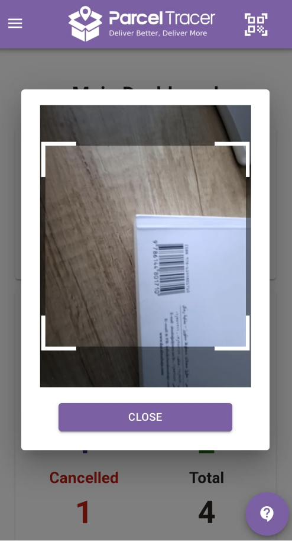

# Introduction

Let's discover parcel tracer in less than 5 minutes!

## What is parcel tracer

[Parcel Tracer](https://parceltracer.app/) is a cloud-based software that helps connect delivery companies, delivery drivers, merchants and end customers all on one platform.

- It allows delivery companies and drivers to manage the delivery cycle, track orders and manage payments and invoices.
- It allows merchants to place and track orders on the platform and view delivery invoices.
- It allows end customers to stay informed about the state of delivery of their order.

## What you'll need

- A computer
- Internet connection
- Preferrably, a mobile device

## What it looks like on your computer

If you are the admin of a delivery organisation, here is how parcel tracer's main dashboard will look like to you. 

It includes several widgets that give you a bird's eye view of the delivery state at your company including:
- Number of orders in each delivery state
- Number of orders in each payment state
- History of delivered and cancelled orders
- Distribution of orders based on region
- Generating profit reports over specific duration

## What it looks like on your mobile phone

You can scan barcodes and lookup orders easily!

## Next Steps

By now, you should have a general clear idea what Parcel Tracer is about.

Yet, there are tons of features to learn about.

We've get you backed by an amazing tutorial so you can unlock the power of our tool!