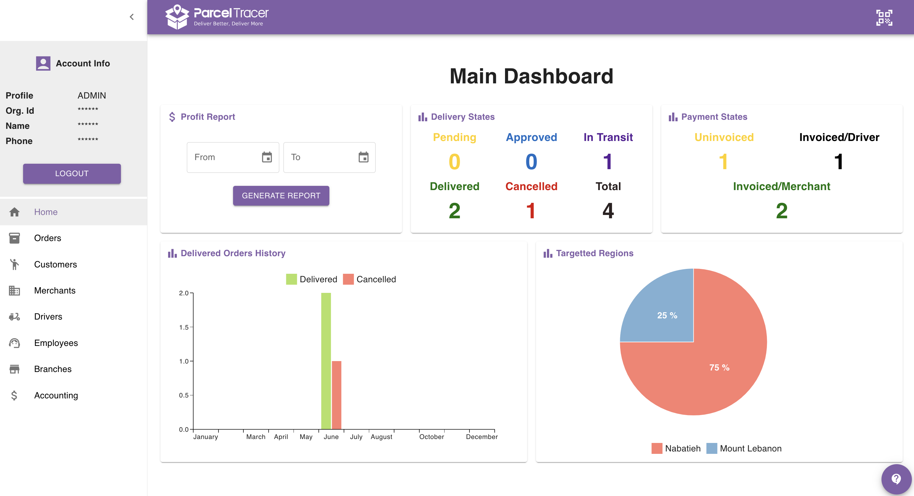

import ReactPlayer from 'react-player'

:::danger Attention
The Home Page is only accessibe to organisation accounts.\
If you are an employee, kindly skip to the next page.
:::

## Introduction

The home page represents a bird's-eye view to the status of all delivery operations in your company.

It includes six widgets:
- Profit report
- Delivery States
- Payments States
- Delivered Orders History
- Targetted Regions

Here is how it would look like:

The next sections explain what each widget means and how it can be useful to monitor your delivery company.

## Profit Report

The profit report allows you to extract a pdf document that summarises the profit of the company over a specific period of time.

To generate a profit report, specify the start and end date, then click **GENERATE REPORT**\
As soon as the report is generated, you will see a download button which you can click to download and view the profit report.

    <ReactPlayer className="react-player" width="100%"
      height="100%"  playing controls={false} url='https://youtu.be/P_QJV4oDHYk' />

## Delivery States

## Payment States

## Delivered Orders History

