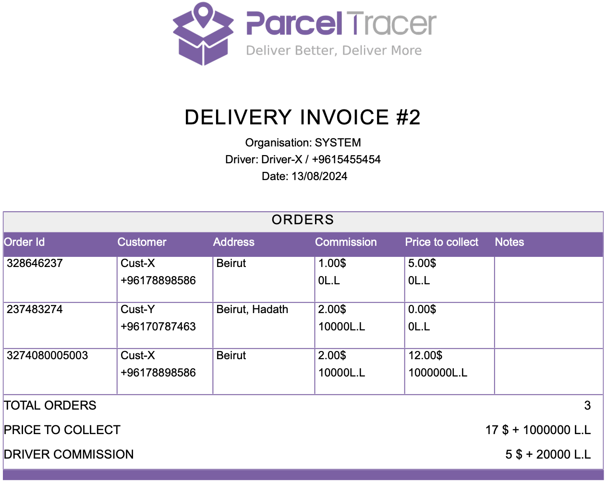

import ReactPlayer from 'react-player'

## How it works

When a driver delivers a group of orders, you might not directly get the money that customers paid to the driver.

When the customer receives the order, the driver will mark the order as delivered, but the order will still be **Uninvoiced**, which means that the delivery company hasn't yet received the money collected by the driver.

Once the driver hands you the collected money, you can register this payment by generating an invoice for your driver.

## What is included in a driver's invoice

A driver's invoice includes a table of delivered (or cancelled) orders.

At the bottom of the table, you will find a summary that indicates the following information:
- **Total Orders**: number of orders included in the invoice.
- **Price To Collect**: is the total amount of money that the driver paid you (including the delivery fee).
- **Driver Commission**: is the amount of money that you paid for the driver as a delivery commission.

:::tip Hint
The **Notes** column contains what is set in the order as a **Public Note**.

This can be useful for exchanged orders; setting the public note to **exchange** will result in including this in the notes column of the invoice.
:::

Here is an example:

In the example above, the driver has collected 17$ + 1000000 L.L, and should keep 5$ + 20000 L.L of them as a delivery commission.

At the end, you will receive the difference (i.e. 12$ + 980000 L.L).

## How to generate an invoice

Navigate to the [accounting page](https://parceltracer.app/accounting) on parcel tracer.

Search for the driver by typing in his name or phone number.

This will open a view that includes three tabs:
- **Cancelled Orders**: a table showing orders associated to this driver that were **cancelled** and are still **uninvoiced**.
- **Delivered Orders**: a table showing orders associated to this driver that were **delivered** and are still **uninvoiced**.
- **Invoices**: a table showing the driver invoices that are already generated for this driver

To generate an invoice, select the orders that the drivers paid for from the **Cancelled Orders** or **Delivered Orders** tabs, then click the **CREATE INVOICE** button.

Once you click the **CREATE INVOICE** button, you will automatically be redirected to the **Invoices** tab and the orders will become in the **Invoiced For Driver** payment state.

The video below shows an example where we create 2 invoices for a driver named **Driver-X**.

The first invoice is a cancellation invoice, and the second one is a delivery invoice.

    <ReactPlayer className="react-player" width="100%"
      height="100%" url='https://youtu.be/7oam2IE1I5s' />

 

:::tip Hint

When you create an invoice for your driver, the created invoice will automatically be visible in the driver's account.

Your driver can view invoices and download them at his own convenience.
:::

:::tip Hint

You can also add notes to your invoices by clicking the pen icon in the notes column of the invoices table.

:::