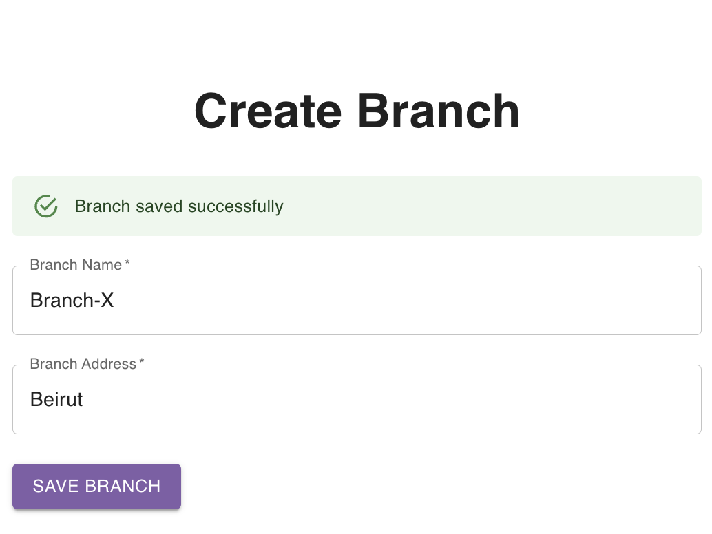

import ReactPlayer from 'react-player'

## Create Branch From Branchs Page

Navigate to the [branches page](https://parceltracer.app/branches).

Click the **Create New** button.

A side drawer will open from the right.

Fill in the branch information and click save.

As an example, let's create an branch named **Branch-X** located in **Beirut**.

The figure below shows how the branch form is filled with the branch data:

