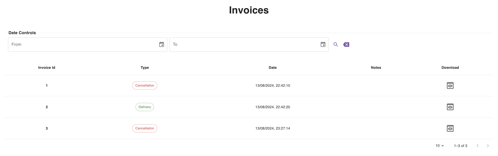
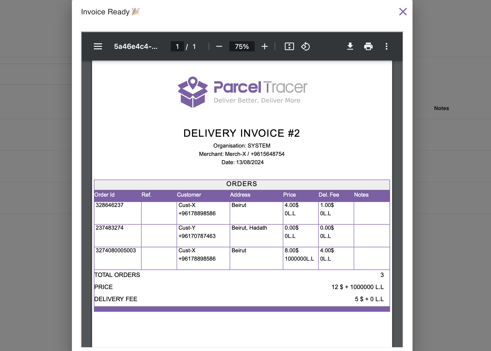

## Introduction

The [invoices page](https://parceltracer.app/invoices) includes a table of all the invoices created by the delivery organisation upon the payment of delivery/cancellation for your orders.

An invoice serves as a proof of payment and it can't be modified or deleted, so your data are always safe against malicious modifications.

An invoice can have one of two types:
- Delivery Invoice: marks the payment for delivered orders.
- Cancellation Invoice: marks the payment (if any) of cancelled/exchanged orders.

## Viewing Invoices

You can view your invoices on the [invoices page](https://parceltracer.app/invoices).

Here is an example that shows 2 invoices, out of which one is a cancellation invoice and one is a delivery invoice.

You can click the eye button to view and download an invoice.

An invoice includes a table of delivered (or cancelled) orders.

At the bottom of the table, you will find a summary that indicates the following information:
- **Total Orders**: number of orders included in the invoice.
- **Price**: is the total price of all delivered/cancelled orders. This amount should usually be paid to you by the delivery organisation upon delivery/cancellation.
- **Delivery Fee**: is the amount of money that is paid to the delivery organisation as delivery fees.

Here is an example:

In the example above, you should have collected 17$ + 1000000 L.L, and should get paid 5$ + 20000 L.L of them as a delivery commission.